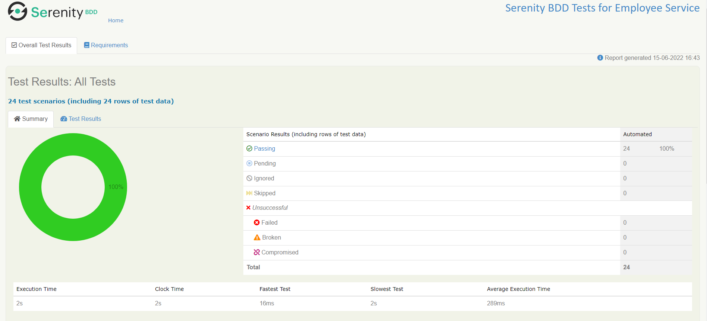
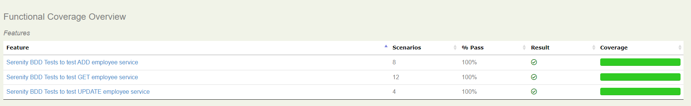
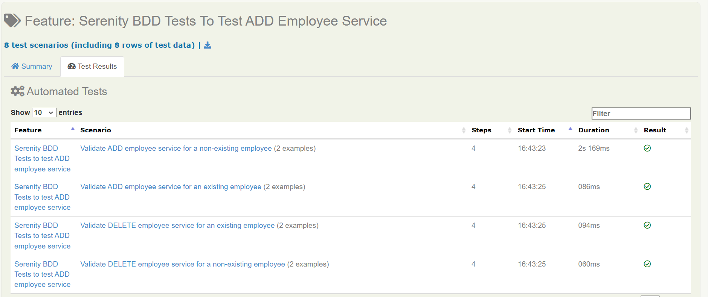
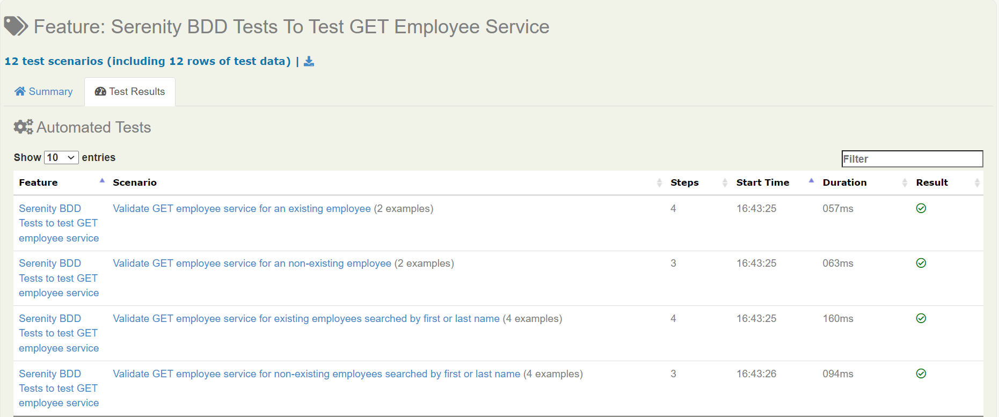
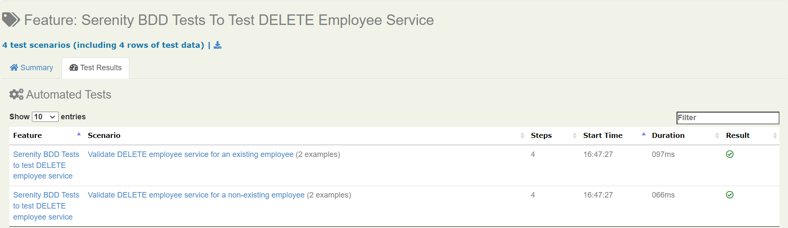
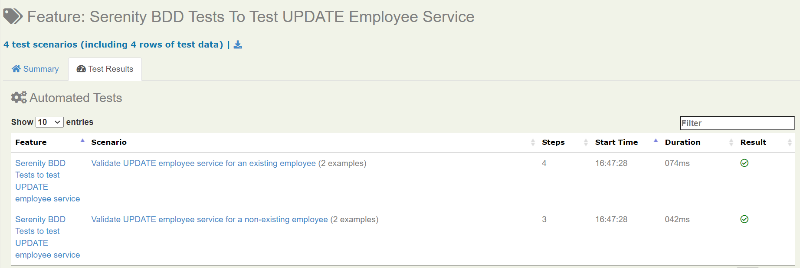
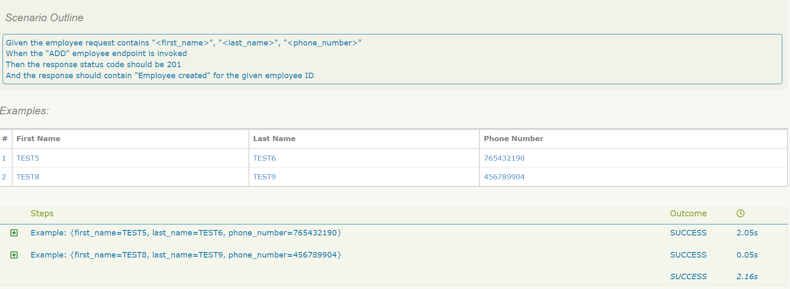
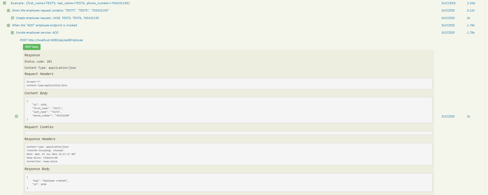

#Employee Service App

Employee service application is a REST service built with SpringBoot, H2 database and Gradle as build tool. 
This repository contains :
````
Backend service code developed with SpringBoot and local H2 database
````
````
JUnit tests
````
````
Automation testing code developed with Serenity BDD framework
````

#Build
This command will run the unit tests, build the application and create the JAR under \build\libs
````
Using Gradle installed in local
--> gradle clean build 
````

````
Using Gradle wrapper
--> ./gradlew clean build 
````

#Starting the application
This command will start the application
````
Using command line
--> java -jar build\\libs\\employee-service-app-0.0.1-SNAPSHOT.jar
````
````
Directly from IDE
--> Navigate to src/main/java/com/cg/employee/EmployeeApplication.java and start the application
````

#Serenity BDD Tests
Serenity BDD helps you write cleaner and more maintainable automated acceptance and regression tests faster. 
Serenity also uses the test results to produce illustrated, narrative reports that document and describe what your application does and how it works. 
Serenity tells you not only what tests have been executed, but more importantly, what requirements have been tested.

##Command to run the Serenity BDD Tests
````
--> gradle clean bddTest or ./gradlew clean bddTest
````
##Test Report
````
--> Reports will be stored in .\target\site\serenity\index.html
````

##Snapshots from Serenity Test Report







