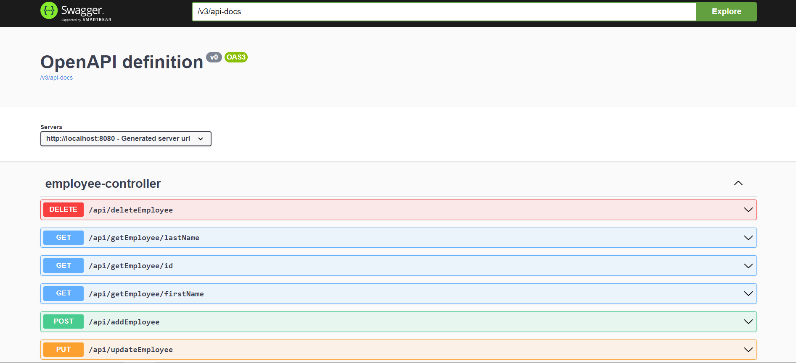
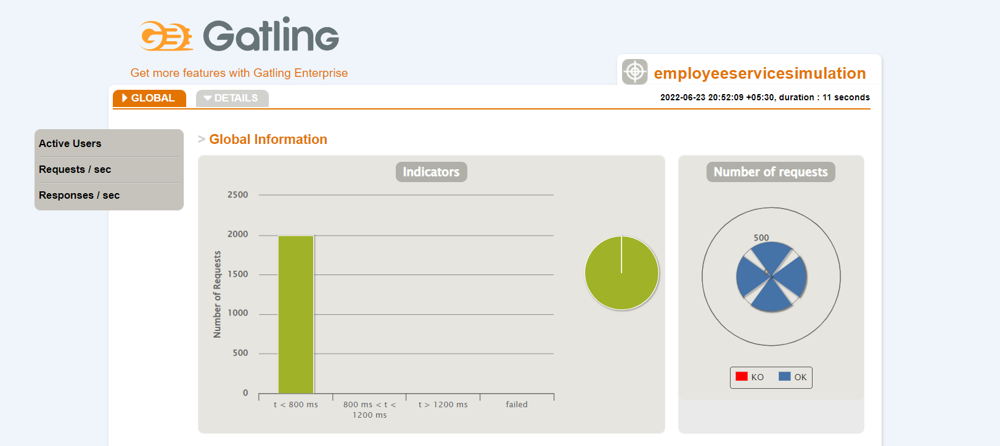
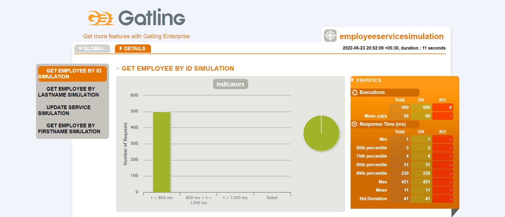
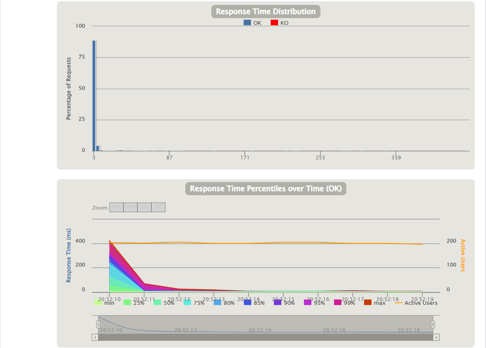
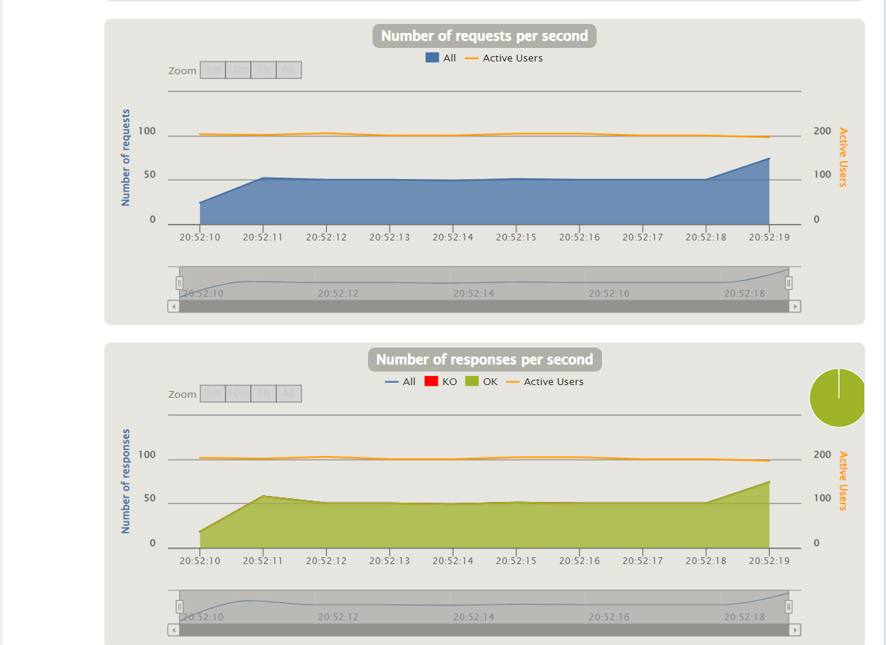
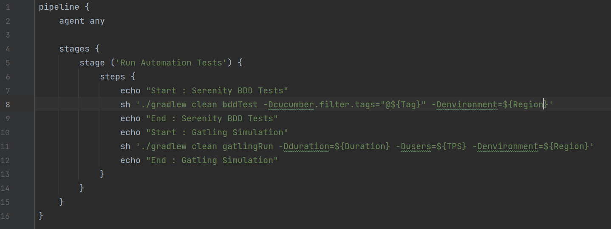

#Employee Service App

Employee service application is a REST service built with SpringBoot, H2 database and Gradle as build tool. 
This repository contains :
````
Backend service code developed with Spring Boot and local H2 database

````
````
JUnit tests

````
````
Functional automated tests developed with Serenity BDD Framework

````
````
Performance/Stress automated tests developed with Gatling & Scala

````

#Build
This command will run the unit tests, build the application and create the JAR under \build\libs
````
Using Gradle installed in local
--> gradle clean build 
````

````
Using Gradle wrapper
--> ./gradlew clean build 
````

#Starting the application
This command will start the application
````
Using command line
--> java -jar build\\libs\\employee-service-app-0.0.1-SNAPSHOT.jar
````
````
Directly from IDE
--> Navigate to src/main/java/com/cg/employee/EmployeeApplication.java and start the application
````

#REST API Documentation Using OpenAPI 3.0
The services exposed by the application can be seen in the below url
````
http://localhost:8080/employee-swagger-ui.html

````


#Serenity BDD Integration for Functional Testing
Serenity BDD helps you write cleaner and more maintainable automated acceptance and regression tests faster. 
Serenity also uses the test results to produce illustrated, narrative reports that document and describe what your application does and how it works. 
Serenity tells you not only what tests have been executed, but more importantly, what requirements have been tested.

##Command to execute the Serenity BDD Tests
````
--> gradle clean bddTest or ./gradlew clean bddTest for running all the tests

To run any specific tag
gradle clean bddTest -Dcucumber.filter.tags="@AddEmployee"
gradle clean bddTest -Dcucumber.filter.tags="@DeleteEmployee"
gradle clean bddTest -Dcucumber.filter.tags="@UpdateEmployee"
gradle clean bddTest -Dcucumber.filter.tags="@GetEmployee"

````
##Serenity Test Report
````
--> Reports will be stored in .\target\site\serenity\index.html
````

##Snapshots from Serenity Test Report


#Gatling Integration for Performance/Stress Testing
Gatling is designed for continuous load testing and integrates with your development pipeline. 
Gatling includes a web recorder and colorful reports. Gatling’s code-like scripting enables you to easily maintain your testing scenarios and seamlessly automate them in your continuous delivery pipeline.

##Command to execute the Gatling Performance Simulation
````
--> gradle clean gatlingRun -Denvironment=dev or ./gradlew clean gatlingRun -Denvironment=dev
To run for a default load of 1 TPS for 1 second

To run customized load
gradle clean gatlingRun -Dusers=50 -Dduration=10 -Denvironment=dev

````

##Gatling Simulation Report
````
--> Reports will be stored in .\build\reports\gatling\employeeservicesimulation-$yyyyMMddHHmmss\index.html
````

##Snapshots from Gatling Simulation Report





#Jenkins CI/CD Integration
Jenkins is the leading 0pen source automation server, Jenkins provides hundreds of plugins to support building, deploying and automating any project

````
Use the Jenkinsfile in the repository to create a pipeline job
````


##Local Jenkins Installation
````
Windows  : https://www.jenkins.io/doc/book/installing/windows/
macOS    : https://www.jenkins.io/doc/book/installing/macos/
Linux    : https://www.jenkins.io/doc/book/installing/linux/

````
#Reference
````
Gradle           : https://docs.gradle.org/current/samples/sample_building_java_libraries.html
Gatling          : https://gatling.io/docs/gatling/reference/current/core/injection/
Serenity         : https://serenity-bdd.github.io/theserenitybook/latest/index.html
Cucumber         : https://cucumber.io/docs/installation/java/
Spring Boot      : https://spring.io/projects/spring-boot
Jenkins Pipeline : https://www.baeldung.com/ops/jenkins-parameterized-builds
 
````
